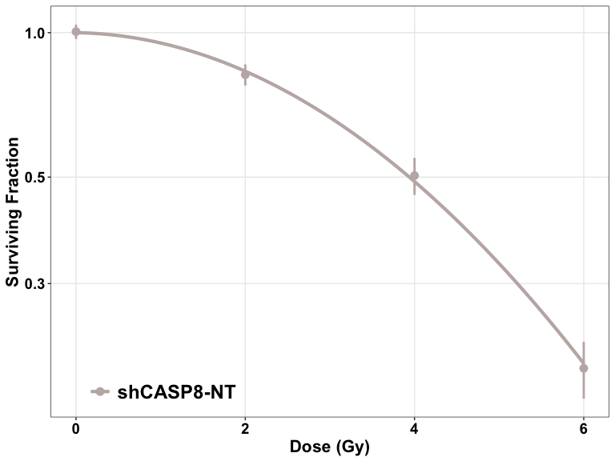

<!-- README.md is generated from README.Rmd. Please edit that file -->


# CellSurvAssay

<!-- badges: start -->
<!-- badges: end -->

**CellSurvAssay** consists of a couple of tools that can be used to
perform Clonogenic Survival Analysis in R very easily and efficiently.
These two tools are:

-   **CellSurvAssay R package**: This helps even beginner R users to
    perform the analysis in R, while maintaining the flexibility of a
    package.

-   **CellSurvAssay Shiny app**: This is a web application that helps
    users with no experience in R to perform the analysis, in R. The app
    is based on the CellSurvAssay R package and can be accessed
    [here](https://pickeringlab.shinyapps.io/CellSurvAssay-App).

# Purpose of the CellSurvAssay R package

-   This R package has been written around
    [CFAssay](https://bioconductor.org/packages/release/bioc/html/CFAssay.html),
    another R package that can be used to perform Cell Survival Assay
    analysis in R. However, **CellSurvAssay** has it’s own purposes and
    advantages:
    -   it makes performing Clonogenic Survival Analysis in R incredibly
        user-friendly and efficient, even for beginner R users who don’t
        have the luxury of time to dig deeper into R,
    -   it arranges all the commonly used steps of clonogenic assay
        analysis in one location and automates the data wrangling steps
        to the extent that only single lines of code suffice for each
        step of the analysis,
    -   it utilizes `ggplot()` to plot the cell survival curves, and
        builds better quality figures than other available R packages,
    -   it is less time consuming and more convenient for the user, as
        it accepts the raw data for the analysis and calculates the
        plating efficiencies by itself, unlike many automated software
        commonly used,
    -   it offers various method options for parameter estimation and
        calculating plating efficiencies, unlike most other available
        software tools, and
    -   as R is being utilized, the methodology stays open and the
        results reproducible.

------------------------------------------------------------------------

*Below is just a quick workflow that can be used to perform Clonogenic
Survival Analysis using this package. For more details on the functions,
different method options for parameter estimation and calculation of
plating efficiency, and customization of the figures, please refer to
the package vignette.*

------------------------------------------------------------------------

# Installing the package

-   The package is being shared through [GitHub](https://github.com/).
    Running the following set of codes installs and loads the package in
    R memory:

``` r
# if installing from Bioconductor
# install BiocManager, if required
if (!require("BiocManager", quietly = TRUE))
    install.packages("BiocManager")
# install CellSurvAssay
BiocManager::install("CellSurvAssay")
# load CellSurvAssay in R
library(CellSurvAssay) 


# if installing from GitHub
# install devtools, if required
if(!require(devtools)) {
    install.packages("devtools")
    library(devtools)
}
# install CellSurvAssay
install_github("arunangshu-github/CellSurvAssay", 
               build_vignettes = TRUE,
               dependencies = TRUE)
# load CellSurvAssay in R memory
library(CellSurvAssay)  
```

-   This vignette can be accessed from R using the following command:

``` r
browseVignettes("CellSurvAssay")
```

# Importing the data set

-   The function `importData()` helps import the data set.

``` r
datatab <- importData("path/to/file", "type of file")
```

-   The package contains a data set that can be used to get familiar
    with the package. It can be imported in the R environment as below:

``` r
datatab <- CASP8_data
```

# Fitting the Linear Quadratic Model

-   The `lqmodelFit()` function helps fit the linear quadratic model for
    any cell type present in the imported data.

``` r
lqmodelFit(datatab, "shCASP8-N")
#> ****** Cell type: shCASP8-N ******
#> 
#> *** Coefficients of LQ-model for cell survival *** 
#> method = ml 
#> PEmethod = fit 
#> 
#> Logarithmic plating efficiencies PE fitted as intercepts 
#> see remark in the manual, 1.2 
#>      Estimate Std. Error   t value     Pr(>|t|)
#> PE1 -1.238340 0.05429647 -22.80702 7.892816e-08
#> PE2 -1.205679 0.05371585 -22.44550 8.815030e-08
#> PE3 -1.297141 0.05537422 -23.42499 6.559791e-08
#> 
#> Shape parameters alpha and beta 
#>          Estimate  Std. Error    t value    Pr(>|t|)
#> alpha -0.01613085 0.038556758 -0.4183664 0.688215852
#> beta  -0.03678049 0.007020955 -5.2386733 0.001200996
#> 
#> Observed and fitted plating efficiencies (%): 
#>     Experiment   PE PEfitted
#> PE1          1 29.6     29.0
#> PE2          2 31.0     29.9
#> PE3          3 26.7     27.3
#> 
#> Residual Deviance: 9.996061 
#> Total residual sum of weighted squares rsswTot: 10.28712 
#> Residual Degrees of Freedom: 7 
#> Dispersion parameter: 1.469589 
#> 
#> Fraction rssw of rsswTot per Experiment 
#>   Experiment rssw perCent
#> 1          1 1.47    14.3
#> 2          2 1.08    10.5
#> 3          3 7.74    75.3
#> 
#> *** Analysis by CellSurvAssay v0.99.0 ***
```

# Plotting Cell Survival curves

-   The cell survival curves can be plotted using two different
    functions: `plotCSCurve()` and `ggplotCSCurve()`.
-   While the former gives the standard curves provided by the CFAssay
    package, the latter is preferred as it uses the widely popular
    `ggplot()` function of R to plot the curves, allowing all the
    customizations and better graphics. It also allows to easily
    download the figures plotted in the users’ own specifications.

### Individual curves

``` r
ggplotCSCurve(datatab, "shCASP8-NT")
```

<!-- -->

### Multiple curves

``` r
ggplotCSCurve(datatab, "shCASP8-NT", "shCASP8-B", "shCASP8-B+Z", "shCASP8-B+Z+N")
```

<!-- -->

# Comparing two curves

-   The `compareCurves()` function helps us statistically compare two
    curves. It prints the ANOVA results.
-   The null hypothesis is that the parameters
    
    and
    
    of both the models are independent of the two curves, while the
    alternate hypothesis is that the parameters are different.

``` r
compareCurves(datatab, "shCASP8-N", "shCASP8-B+Z+N")
#> ****** Cell type 1: shCASP8-N   ||   Cell type 2: shCASP8-B+Z+N ******
#> 
#> Overall comparison test for coefficients alpha and beta of LQ-models 
#> ==================================================================== 
#> method = ml 
#> PEmethod = fit 
#> 
#> 6 PEs fitted as intercepts. To look at, use simple R print function. 
#> Null hypothesis (Model 1): one set of shape parameters alpha and beta for all data 
#> ---------------------------------------------------------------------------------- 
#>          Estimate  Std. Error    t value     Pr(>|t|)
#> alpha -0.01910478 0.020810067 -0.9180547 3.722228e-01
#> beta  -0.03692732 0.003798381 -9.7218568 4.061270e-08
#> 
#> Goodness-of-fit values 
#>  Residual Deviance: 12.85619 
#>  Total sum of squared weighted residuals rsswTot: 13.19573 
#>  Residual Degrees of Freedom: 16 
#>  Dispersion parameter: 0.8247333 
#> 
#> Alternative hypothesis (Model 2): two sets of shape parameters alpha and beta 
#> ----------------------------------------------------------------------------- 
#>                              Estimate  Std. Error    t value     Pr(>|t|)
#> alpha:curvesshCASP8-B+Z+N -0.02224331 0.031717703 -0.7012901 4.946148e-01
#> alpha:curvesshCASP8-N     -0.01613085 0.030528750 -0.5283823 6.055094e-01
#> beta:curvesshCASP8-B+Z+N  -0.03710309 0.005804313 -6.3923312 1.675728e-05
#> beta:curvesshCASP8-N      -0.03678049 0.005559103 -6.6162636 1.158171e-05
#> 
#> Goodness-of-fit values 
#>  Residual Deviance: 12.60644 
#>  Total sum of squared weighted residuals rsswTot: 12.89855 
#>  Residual Degrees of Freedom: 14 
#>  Dispersion parameter: 0.9213253 
#> 
#> Analysis of Variance Table and F-test
#> Model 2 versus Model 1
#>   Resid. Df Resid. Dev Df Deviance      F Pr(>F)
#> 1        16     12.856                          
#> 2        14     12.606  2  0.24975 0.1355 0.8744
#> 
#> *** Analysis by CellSurvAssay v0.99.0 ***
```

# Calculating Dose Enhancement Ratio

-   The function `calculateDER()` calculates the Dose Enhancement Ratio.

``` r
calculateDER(datatab, "shCASP8-NT", "shCASP8-N", 0.25)
#> *** Dose Enhancement Ratio ***
#> 
#> control = shCASP8-NT
#> treatment = shCASP8-N
#> survival fraction = 0.25
#> method = ml
#> PEmethod = fit
#> DER = 0.945622065301553
#> 
#> *** Analysis by CellSurvAssay v0.99.0 ***
```

-   Here, the DER of shCASP8-NT : shCASP8-N is 0.9456221.
